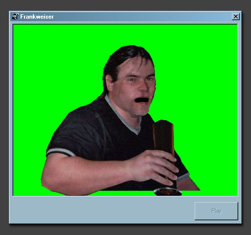



## Frankweiser \*\*FUNNIEST SUBMISSION EVER\!\!\!\*\*

### Description

Frankweiser is the latest Frank app to be developed by myself. It shows a way of back buffering and animation using the bitblt API. It plays sounds and can be easily scripted. This version comes with one scene. You can click on Frank while he is not reinacting his scene, left click will make him burp, right click will make him drink his beer, its MAD and a MUST SEE!!!! Please vote and comment on it ;)
 
### More Info
 

             |
---                |---
**Submitted On**   |2001-08-07 13:41:34
**By**             |[Niknak\!\!](https://github.com/Planet-Source-Code/PSCIndex/blob/master/ByAuthor/niknak.md)
**Level**          |Advanced
**User Rating**    |3.8 (23 globes from 6 users)
**Compatibility**  |VB 6\.0
**Category**       |[Jokes/ Humor](https://github.com/Planet-Source-Code/PSCIndex/blob/master/ByCategory/jokes-humor__1-40.md)
**World**          |[Visual Basic](https://github.com/Planet-Source-Code/PSCIndex/blob/master/ByWorld/visual-basic.md)
**Archive File**   |[Frankweise24221872001\.zip](https://github.com/Planet-Source-Code/niknak-frankweiser-funniest-submission-ever__1-25935/archive/master.zip)

